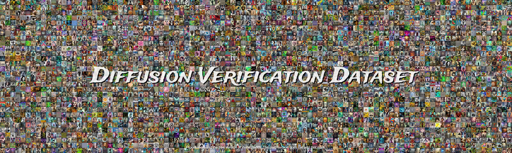

# Diffusion-Verification-Model  

  

In this repository, i provided the complete implementation of my text2image verification model, as desrbibed in the paper "Identical Origins: A Novel Approach to Verifying Text-to-Image Model Consistency"

The code in this notebook contains:
*   The steps of creating the diffusion verification dataset (DVD).
*   Comprehensive evaluation of the prompts and images in the DVD.
*   Complete training and evaluation of the verification models.

For accseesing the trained models and the verification dataset, submit an accsess request for the drive in this [link](https://drive.google.com/drive/folders/1pofCMwuFh6hJQWZ6u_b18lOA-P-lsSa0?usp=drive_link) .
